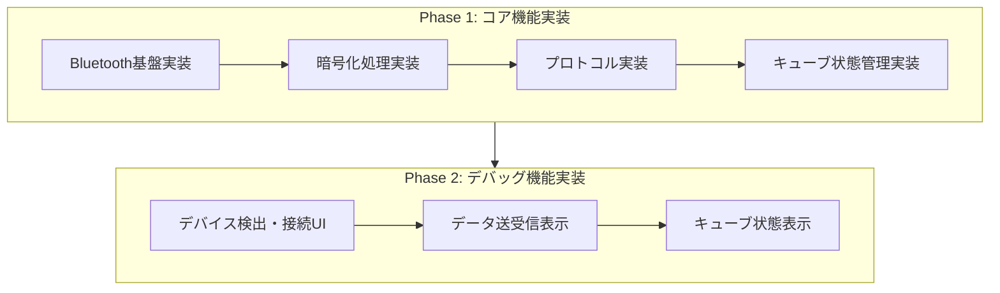

# スマートキューブアプリ 実装計画

## 1. 実装フェーズ



## 2. 実装の優先順位

1.  **Bluetooth基盤の実装**
    *   デバイス検出・接続処理
    *   データ送受信の基本実装
2.  **暗号化処理の実装**
    *   AES-128暗号化/復号化
    *   キー生成処理
3.  **プロトコル実装**
    *   コマンド生成
    *   レスポンス解析
4.  **キューブ状態管理の実装**
    *   状態の保持と更新
    *   移動の追跡

## 3. デバッグ機能

1.  **接続機能**
    *   デバイスのスキャン
    *   接続/切断操作
2.  **データ表示**
    *   生データの送受信表示
    *   エンコード/デコードデータの表示
3.  **キューブ状態表示**
    *   現在の状態表示
    *   移動履歴の表示

## 4. ファイル構造

```
lib/
├── services/
│   ├── bluetooth/
│   │   ├── interface/
│   │   │   ├── device.dart
│   │   │   └── service.dart
│   │   └── windows/
│   │       └── service.dart
│   └── gan/
│       ├── protocol/
│       │   ├── command.dart
│       │   └── response.dart
│       ├── crypto/
│       │   └── aes.dart
│       └── core/
│           └── state_manager.dart
└── ui/
    └── debug/
        ├── debug_screen.dart
        ├── connection_view.dart
        ├── data_view.dart
        └── cube_state_view.dart
```

## 5. 現在の進捗

### コア機能

*   Bluetoothインターフェースの実装 (`lib/services/bluetooth/interface/`)
*   Windows Bluetooth実装 (`lib/services/bluetooth/windows/`)
*   GAN V4プロトコルのコマンド生成 (`lib/services/gan/protocol/command.dart`)
*   GAN V4プロトコルのレスポンス定義と解析 (`lib/services/gan/protocol/response.dart`)
*   GAN V4プロトコルの暗号化処理 (`lib/services/gan/crypto/aes.dart`)
*   GAN V4プロトコルハンドラ (`lib/services/gan/protocol/handler.dart`)

### UI

*   デバッグ画面の骨格 (`lib/ui/debug/debug_screen.dart`)
*   接続ビューの骨格 (`lib/ui/debug/connection_view.dart`)
*   データビューの骨格 (`lib/ui/debug/data_view.dart`)
*   キューブ状態ビューの骨格 (`lib/ui/debug/cube_state_view.dart`)

### テスト

*   暗号化処理、コマンド生成、レスポンス解析の単体テスト (`test/`)

### 課題

*   `flutter run -d windows` 実行時に、`RenderFlex children have non-zero flex but incoming height constraints are unbounded.` というエラーが発生する。
*   Bluetooth 接続が確立するものの、データを受信できない。
*   `lib/services/gan/crypto/aes.dart` の暗号化処理が正しく動作していない可能性がある。

### 次のステップ

1.  `RenderFlex children have non-zero flex but incoming height constraints are unbounded.` というエラーを解決する。
2.  `lib/services/gan/crypto/aes.dart` の暗号化処理を修正し、GAN キューブとの通信を確立する。
3.  デバッグUIを完成させ、Bluetooth接続、データ送受信、およびプロトコル解析が正常に行われるか確認する。